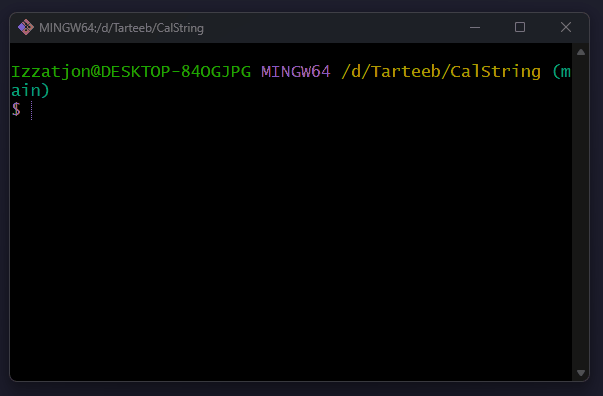
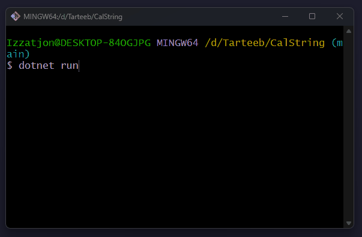
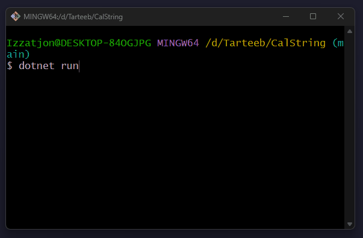
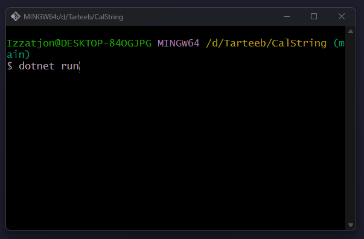
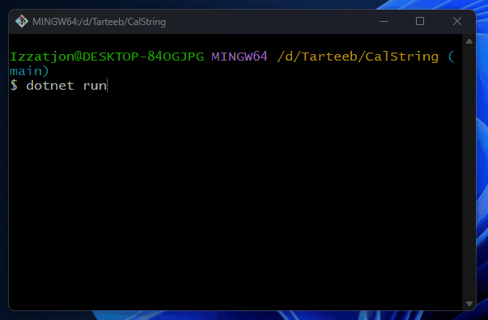
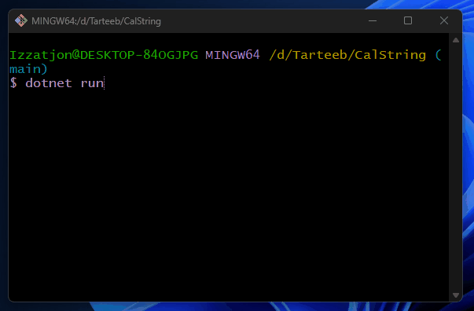

# CalString 🧮

String ko'rinishidagi matematik ifodalarni hisoblash dasturi

---

## 🚀 Versiyalar

| Versiya | Imkoniyat                                 | Misol          |
| ------- | ----------------------------------------- | -------------- |
| **V1**  | Faqat qo'shish, bir xonali sonlar         | `1+2+3+4`      |
| **V2**  | Qo'shish va ayirish, bir xonali sonlar    | `5+3-2+1`      |
| **V3**  | To'rt amal (`+ - * /`), bir xonali sonlar | `2+3*4-6/2`    |
| **V4**  | To'rt amal, **2 ta** ko'p xonali son      | `123+456`      |
| **V5**  | To'rt amal, **ko'p** ko'p xonali sonlar   | `12*45/2+23-7` |
| **V6**  | Qavslarni qo'llab-quvvatlash              | `(2+3)*4`      |
| **V7**  | Daraja (`^`) amali                        | `2*3^2+1`      |

---

## 🎬 Dastur ishlashi

### V1 — Faqat qo'shish

### V2 — Qo'shish va ayirish

### V3 — To'rt amal (bir xonali)

### V4 — Ko'p xonali (2 son)

### V5 — To'liq versiya

### V6 — To'liq versiya

### V7 — To'liq versiya

---

## 👨‍💻 Muallif

**Qodirov Izzatjon**

- GitHub: [rambo-mb](https://github.com/rambo-mb)
